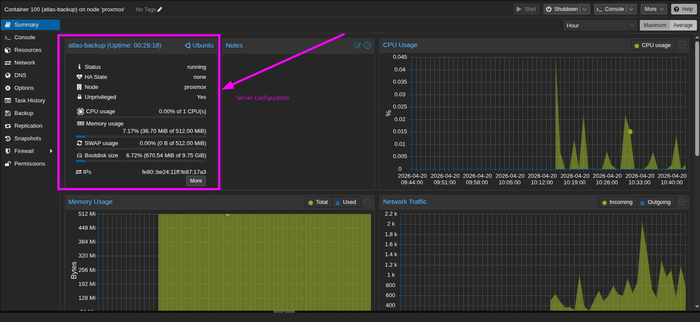
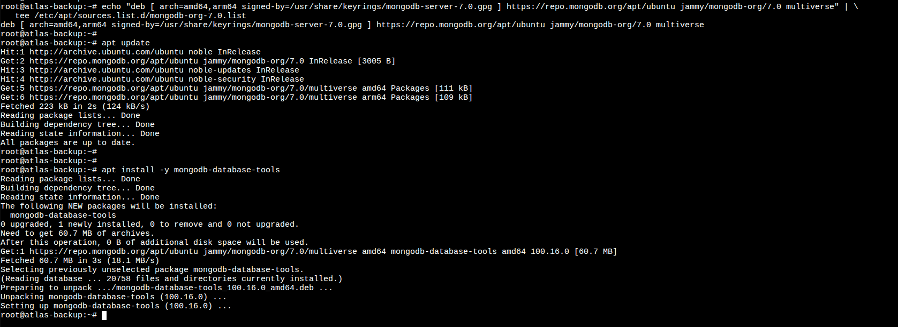
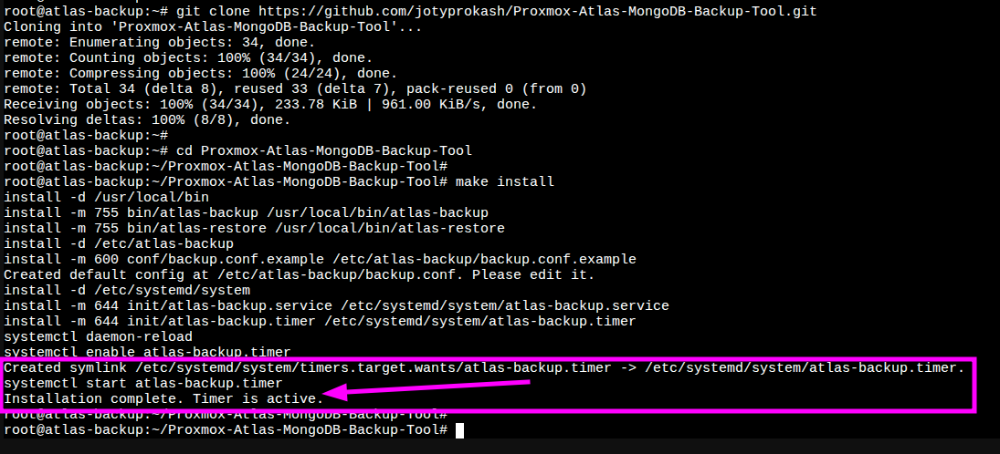
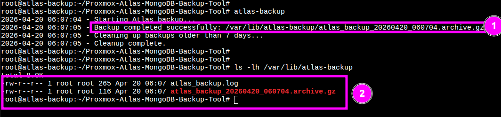

# Implementation Journey

This document captures the step-by-step process of deploying the Proxmox Atlas Backup tool, from setting up the environment to final verification.

## 1. Environment Setup (Proxmox LXC)

We used a lightweight **Ubuntu 24.04 (Noble)** LXC container to host the backup utility.

- **Container ID**: 100
- **Hostname**: `atlas-backup`
- **Resources**: 512MB RAM, 1 CPU, 10GB Disk
- **Type**: Unprivileged (for security)



## 2. Installing Dependencies

Before installing our tool, we need to prepare the Ubuntu environment with `mongodb-database-tools` and standard utilities.

### Update System
```bash
apt update && apt upgrade -y
apt install -y curl make git gnupg
```

### Install MongoDB Database Tools
We add the official MongoDB repository to get the latest `mongodump` and `mongorestore`.

```bash
# Add MongoDB GPG Key
curl -fsSL https://www.mongodb.org/static/pgp/server-7.0.asc | \
   gpg -o /usr/share/keyrings/mongodb-server-7.0.gpg \
   --dearmor

# Add the repository (using Jammy for 22.04 compatibility as Noble path is pending)
echo "deb [ arch=amd64,arm64 signed-by=/usr/share/keyrings/mongodb-server-7.0.gpg ] https://repo.mongodb.org/apt/ubuntu jammy/mongodb-org/7.0 multiverse" | \
   tee /etc/apt/sources.list.d/mongodb-org-7.0.list

# Install tools
apt update
apt install -y mongodb-database-tools
```



## 3. Deploying the Backup Tool

Now we pull the code from GitHub and use the automated installer.

```bash
git clone https://github.com/jotyprokash/Proxmox-Atlas-MongoDB-Backup-Tool.git
cd Proxmox-Atlas-MongoDB-Backup-Tool
make install
```

### Step 3: Deploying the Backup Tool


## 4. Configuration

Edit the configuration file to add your MongoDB Atlas connection string and preferred notification webhook.

```bash
nano /etc/atlas-backup/backup.conf
```

**Key Variables:**
- `ATLAS_URI`: Your `mongodb+srv://...` connection string.
- `WEBHOOK_URL`: Discord/Slack webhook for alerts.

## 5. Verification

### Manual Backup Test
Run the backup manually to ensure everything is configured correctly.

```bash
atlas-backup
```

### Manual Backup Test


### Systemd Automation
Verify that the daily timer is scheduled.

```bash
systemctl list-timers --all | grep atlas
```

---
*This journey ensures a robust, production-grade backup pipeline is in place.*
